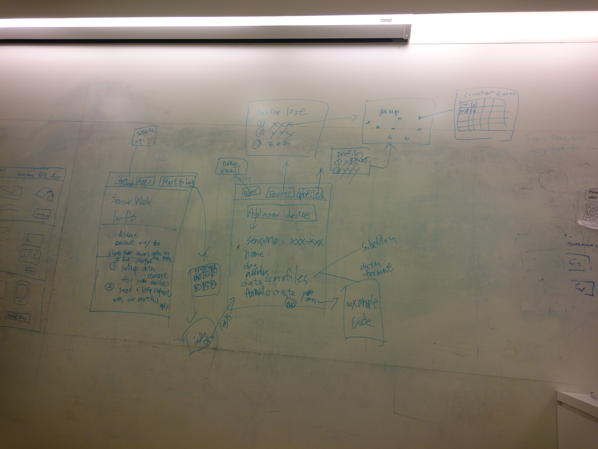

# Todo for SensorWeb Portal

## Draft for SensorWeb Portal


## Tasks
### Restful APIs
1. Add a new sensor for a profile
2. Get sensor list by coordinates
3. Push specific sensor's data (used by maker's device)
4. Get specific sensor's mata data
5. Get specific sensor's raw data

### Data Schema
#### Users
```
{
  "id": "xxxxxx",
  "name": "Evan Xd",
  "email": "evan@tseng.io",
  "accessToken": "xxxxxxxxxxxxxxxx"
}
```

#### Sensors
```
{
  "profileId": "xxxxxx",
  "sensorId": "xxxxxx",
  "userId": "xxxxxx",
  "name": "pm2.5",
  "description": "It is about air quality.",
  "coordinate": "120.982025, 23.973875"
}
```

#### Sensor Data
The table name is `deviceId`.
```
{
  "datetime": "2013-08-25T17:00:00+00:00",
  "value1": 11,
  "value2": false
}
```

#### Profiles
```
{
  "id": "xxxxxx",
  "name": "Air Quality",
  "description": "It is about air quality."
  "dataFormat": {
    "value1": "Number",
    "value2": "Boolean"
  }
}
```

### Webpages
1. Landing page (hardcode)
2. Programs page (can add a new program)
3. Programs info page (google login)
4. Setup a sensor page (use restful API 1)
5. Sensor list page (use restful API 2)
6. Profile list page (hardcode)
7. Sensor map page (use restful API 4)
8. Sensor's raw data page (use restful API 5)

### Features
1. L10N
